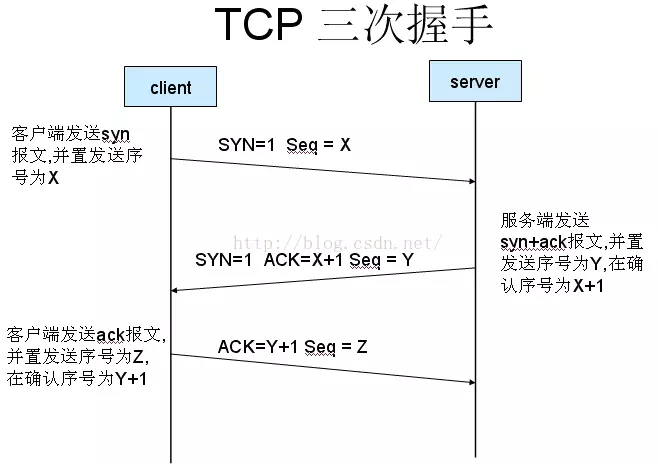

# 前端面试题总结

## CSS 篇

### 1. 盒模型

页面渲染时，dom 元素所采用的 **布局模型**。可通过 box-sizing 进行设置。根据计算宽高的区域可分为：

- content-box (W3C 标准盒模型)
- border-box (IE 盒模型)
- padding-box
- margin-box (浏览器未实现)

### 2. BFC

**块级格式化上下文**，是一个独立的渲染区域，让处于 BFC 内部的元素与外部的元素相互隔离，使内外元素的定位不会相互影响。

- 触发条件:

  - 根元素
  - position: absolute/fixed
  - display: inline-block / table
  - float 元素
  - ovevflow !== visible

- 规则:

  - 属于同一个 BFC 的两个相邻 Box 垂直排列
  - 属于同一个 BFC 的两个相邻 Box 的 margin 会发生重叠
  - BFC 中子元素的 margin box 的左边， 与包含块 (BFC) border box 的左边相接触 (子元素 absolute 除外)
  - BFC 的区域不会与 float 的元素区域重叠
  - 计算 BFC 的高度时，浮动子元素也参与计算
  - 文字层不会被浮动层覆盖，环绕于周围

- 应用:
  - 阻止 margin 重叠
  - 可以包含浮动元素 —— 清除内部浮动(清除浮动的原理是两个 div 都位于同一个 BFC 区域之中)
  - 自适应两栏布局
  - 可以阻止元素被浮动元素覆盖

### 3. 层叠上下文

元素提升为一个比较特殊的图层，在三维空间中 (z 轴) 高出普通元素一等。


### 4. 水平垂直居中布局

- 未知宽高

```
position: absolute;
left: 50%;
right: 50%;
transform: tanslate(-50%, -50%);
```

- 已知宽高

```
position: absolute;
left: 0;
right: 0;
top: 0;
bottom: 0;
margin: auto;
```

- 使用 flex

```
display: flex;
justify-content: center;
align-items: center;
```

### 5. 选择器优先级

- !important > 行内样式 > #id > .class > tag > \* > 继承 > 默认
- 选择器 从右往左 解析

### 6. 清除浮动

- 使用伪类

```
.clear-fix{
  *zoom: 1;
}
.clear-fix::after{
  content: '';
  display: block;
  clear: both;
}
```

- 创建父级 BFC: overflow: hidden
- 父级设置高度, 可以防止父级高度塌陷

### 7. link 与 @import 的区别

- link 可以做很多事
  - 预解析 DNS (rel="dns-prefetch")
  - 预加载 JS (rel="prefetch")
  - 预渲染 HTML (rel="prerender")
  - 预链接服务器 (rel="preconnect")
  - 加载 CSS
- @import 需要 IE5 以上才能使用，只能加载 CSS

### 8. CSS 预处理器

- less
- sass
- stylus
- postcss
- 功能：
  - 嵌套
  - 变量
  - 循环语句
  - 条件语句
  - 自动前缀
  - 单位转换
  - mixin 复用

### 9. 三栏布局

- flex

```
<div class="container">
    <div class="left">left</div>
    <div class="main">main</div>
    <div class="right">right</div>
</div>
.container{
    display: flex;
}
.left{
    flex-basis: 200px;
    background: pink;
}
.main{
    flex: 1;
    background: #F90;
}
.right{
    flex-basis: 200px;
    background: pink;
}
```

- position + margin

```
<div class="container">
    <div class="left">left</div>
    <div class="right">right</div>
    <div class="main">main</div>
</div>
body,html{
    padding: 0;
    margin: 0;
}
.left,.right{
    position: absolute;
    top: 0;
    background: pink;
}
.left{
    left: 0;
    width: 200px;
}
.right{
    right: 0;
    width: 200px;
}
.main{
    margin: 0 200px ;
    background: #F90;
}
```

- float + margin

```
<div class="container">
    <div class="left">left</div>
    <div class="right">right</div>
    <div class="main">main</div>
</div>
body,html{
    padding: 0;
    margin: 0;
}
.left{
    float: left;
    width: 200px;
    background: pink;
}
.main{
    margin: 0 200px;
    background: #F90;
}
.right{
    float: right;
    width: 200px;
    background: pink;
}
```

## JS 篇

### 1. 原型

- 原型指的是两个原型属性：
  - `prototype`: 显示原型属性
  - `__proto__`： 隐式原型属性
- 所有函数都有显示原型属性。 它的值叫做原型对象，这个原型对象默认有两个属性：
  - `constructor` 指向函数本身
  - `__proto__` 指向 Object.prototype
    - 特殊: `Object.prototype.__proto__` === `null` 这个就是原型链尽头
- 所有对象都有隐式原型属性。
- 对象的隐式原型属性的值指向其构造函数显示原型属性的值
- 如果这个普通对象是你 new 的，构造函数就是你 new 的函数,如果不是，就是 new Obejct 产生的，所以构造函数就是 Object
- 所有函数都是 new Function 产生的，包括它自己 Function
- 所有数组都是 new Array 产生的

### 2. 原型链

- 由对象的隐式原型属性组成的链叫原型链
- 作用：查找对象属性
- 注意：

  - 读取/查找对象属性时，会沿着原型链找，设置对象属性只看直接属性，不看原型链
  - 原型链的尽头是`Object.prototype.__proto__`

    

### 3. 执行上下文

- 执行上下文可以简单理解为一个对象：

  - 全局执行上下文对象 window
  - 函数执行上下文对象
  - eval 执行上下文

- 全局执行上下文对象（真实存在的）

  - 在执行全局代码前将 window 确定为全局执行上下文
  - 对全局数据进行预处理
    - var 定义的全局变量==>undefined, 添加为 window 的属性
    - function 声明的全局函数==>赋值(fun), 添加为 window 的方法
    - this==>赋值(window)
  - 开始执行全局代码

- 函数执行上下文对象（我们看不见的）
  - 在调用函数, 准备执行函数体之前, 创建对应的函数执行上下文对象
  - 对局部数据进行预处理
    - 形参变量==>赋值(实参)==>添加为执行上下文的属性
    - arguments==>赋值(实参列表), 添加为执行上下文的属性
    - var 定义的局部变量==>undefined, 添加为执行上下文的属性
    - function 声明的函数 ==>赋值(fun), 添加为执行上下文的方法
    - this==>赋值(调用函数的对象)
  - 开始执行函数体代码

### 4. 作用域

- 概念：就是一块"地盘", 一个代码段所在的区域
- 特点：它是静态的(相对于上下文对象), 在编写代码时就确定了
- 分类：
  - 全局作用域
  - 函数作用域
  - 块作用域(ES6 有了)
- 作用：隔离变量，不同作用域下同名变量不会有冲突

### 5. 作用域链

- 概念：多个上下级关系的作用域形成的链
- 方向：从小向大的(从内到外)
- 作用：查找变量的规则

### 6. 闭包

- 产生条件：
  - 函数定义嵌套
  - 内部函数引用外部函数的局部变量
  - 调用外部函数
- 概念：一个包含被引用局部变量的“closure 对象", 存在嵌套的内部函数中
- 作用：
  - 延长了局部变量的生命周期
  - 让函数外部可以操作(读写)到函数内部的数据(变量/函数)
- 应用：
  - 高阶函数
- 生命周期：
  - 产生：在嵌套内部函数定义执行完时就产生了(不是在调用)
  - 死亡：在嵌套的内部函数成为垃圾对象时
- 缺点：容易导致内存泄漏（使用完及时释放）

### 7. script 的 async 和 defer

- async: 异步加载，加载完立即执行
- defer: 异步加载，加载完顺序执行

### 8. new 关键字做了什么事

- 创建实例对象
- 实例对象的`__proto__` === 构造函数的 `prototype`
- 强制绑定构造函数的 this 指向实例对象，调用构造函数
- 返回实例对象(如果构造函数自己 return 对象时，则返回该值)

### 9. 继承

- 组合继承： 构造函数 + 原型

```
function Father(name, age) {
  this.name = name;
  this.age = age;
}

Father.prototype.setName = function (name) {
  this.name = name;
};

Father.prototype.setAge= function (age) {
  this.age = age;
};

function Son(name, age, sex) {
  // 为了复用给实例对象添加属性代码
  Father.call(this, name, age);
  this.sex = sex;
}

// 为了继承父类的原型上的方法
Son.prototype.__proto__ = Father.prototype;

Son.prototype.setSex = function (sex) {
  this.sex = sex;
};
```

- 使用 ES6 的语法糖 class / extends

```
class Person {
  constructor(name, age) {
    // 定义实例对象的属性
    this.name = name;
    this.age = age;
  }
  // 定义原型上的方法
  setName(name) {
    this.name = name;
  }
}

// 定义Son类继承Person类
class Son extends Person {
  // 当你使用extends继承时，你可以不定义constructor方法
  // 如果你要定义constructor方法，必须在里面调用super
  constructor(name, age, sex) {
    super(name, age); // 调用父类构造方法
    this.sex = sex;
  }
  setAge(age) {
    this.age = age;
  }
}
```

### 10. 类型判断

- typeof (问题不能判断 null object array)
- instanceof (一般用来判断对象类型)
- Object.prototype.toString.call(target).slice(8, -1)

### 11. 模块化

- CommonJS: require / exports / module.exports
- ES6: import / export
- AMD: requirejs
- CMD: seajs

### 12. 总结 this 指向

- 函数直接调用: 指向 window(在 ES5 严格模式下是 undefined)
- 对象.函数调用: 指向对象
- 函数 call/apply 调用: 指向传入的第一个参数
- 函数 new 调用: 执行返回的实例对象
- 回调函数：
  - 定时器回调函数，指向 window(在 ES5 严格模式下是 undefined)
  - DOM 事件回调函数，指向绑定事件的 DOM 元素
- React 组件类函数
  - 生命周期函数 this 指向组件实例对象
  - 其他函数默认为 undefined
- 箭头函数
  - 没有自己的 this，指向外层函数的 this

### 13. 谈谈 ES5/6/7~

- ES5
  - 严格模式 use strict
  - 函数 bind 方法
- ES6
  - 箭头函数
  - promise
  - Set / Map 容器
- ES7
  - \*\*
  - Array.prototype.includes
- ES8
  - async
  - Object.keys
- ES9
  - Promise.finally
- ES10
  - 动态导入 js: import
  - Array.prototype.flat

### 14. 谈谈 babel

- 用来编译 JS/JSX 语法的（JS 兼容性处理）
  - 将 ES6 以上的 JS 语法编译成 ES5 以下的 JS 语法
  - 将 JSX 语法编译成 JS 语法

### 15. 谈谈 ESLint

- 用来检查 JS 语法错误

### 16. 谈谈数组的方法

- Array.prototype.filter
- Array.prototype.reduce
- Array.prototype.map

## 手写 JS 篇

### 1. 深度克隆

```
function checkType(target) {
  return Object.prototype.toString.call(target).slice(8, -1);
}

function deepClone(target) {
  let result = null;
  const type = checkType(target);
  if (type === 'Array') {
    result = [];
  } else if (type === 'Object') {
    result = {};
  } else {
    return target;
  }
  for (const key in target) {
    result[key] = deepClone(target[key]);
  }
  return result;
}
```

### 2. instanceof 实现原理

- A instanceof B: 检查 A 的隐式原型是否在 B 的显示原型上

```
function _instanceof(a, b) {
  a = a.__proto__;
  b = b.prototype;

  while(a !== b) {
    if (a === null) return false;
    a = a.__proto__;
  }

  return true;
}
```

### 3. 防抖和节流

```
// 防抖
function debounce(fn, time) {
  let timer = null;
  return function debounced() {
    // oninput事件绑定的回调函数实际上是debounced
    // debounced函数有this，所以this指向被绑定的DOM元素
    const that = this;
    // 存储参数（event）
    const args = arguments;
    // 清除定时器，清除上一次调用的函数
    clearTimeout(timer);
    timer = setTimeout(function () {
      // 直接调用，this指向window
      // 需求：将fn的this指向dom元素
      // 调用函数没有传参，没有event
      fn.apply(that, args);
    }, time)
  }
}
// 节流
function throttle(fn, time) {
  let lastTime = 0;
  return function throttled() {
    const nowTime = Date.now();
    // 如果时间差小于time，就不执行
    if (nowTime - lastTime < time) return;
    fn.apply(this, arguments);
    lastTime = nowTime;
  }
}
```

### 4. 自定义 Promise

### 5. 数组排序

```
function quickSort(arr) {
  const length = arr.length;
  // 当数组长度小于等于1时，不需要进行排序
  if (length <= 1) return arr;
  // 取出一个基准值（中间数）
  const index = Math.floor(length / 2)
  const value = arr.splice(index, 1)[0];
  // 定义数组
  const leftArr = [];
  const rightArr = [];
  // 遍历数组，小左 大右
  for (let index = 0; index < arr.length; index++) {
    const element = arr[index];
    if (element < value) {
      leftArr.push(element);
    } else {
      rightArr.push(element);
    }
  }
  // 对左边/右边数组 分别在进行快速排序
  const newLeftArr = quickSort(leftArr);
  const newRightArr = quickSort(rightArr);
  // 从左到右 合并成一个数组
  return newLeftArr.concat([value], newRightArr);
}
```

### 6. 数组去重

```

```

### 7. 自定义 call / apply / bind

```
Function.prototype.myCall = function (context, ...args) {
  context.__proto__._fn = this;
  const result = context._fn(...args);
  delete context.__proto__._fn;
  return result;
}

Function.prototype.myApply = function (context, args) {
  context.__proto__._fn = this;
  const result = context._fn(...args);
  delete context.__proto__._fn;
  return result;
}

Function.prototype.myBind = function (context, ...args1) {
  const _that = this;
  return function (...args2) {
    context.__proto__._fn = _that;
    const result = context._fn(...args1, ...args2);
    delete context.__proto__._fn;
    return result;
  }
}
```

## 浏览器

### 1. 跨标签页通讯

- localStorage + window.onstorage 事件
- cookie + 定时器轮询

### 2. 事件轮询机制

- 流程：

  - 浏览器从上到下依次执行所有代码。同步代码顺序执行，异步代码交给分线程执行。
  - 分线程会执行异步代码，等异步代码执行完后会将回调函数添加到回调队列中
  - 等浏览器将全局所有代码执行完毕后，会轮询访问回调队列：依次取出、同步执行

- 异步代码执行机制：
  - 宏任务/微任务
    - 微任务优先级高，宏任务优先级低
    - 微任务优先级最高的是 process.nextTick, 其他顺序执行
    - 宏任务看 nodejs 事件轮询机制
  - nodejs 事件轮询机制
    - 分为 6 个阶段：timers、pending、idea、prepare、poll、check、close

### 3. 从输入 url 到展示的过程

- DNS 解析
- TCP 链接：TCP 三次握手
- 发送请求：请求报文
- 接受响应：响应报文
- 浏览器渲染页面
- 断开链接：TCP 四次挥手

### 4. 重绘与回流

当元素的样式发生变化时，浏览器需要触发更新，重新绘制元素。这个过程中，有两种类型的操作，即重绘与回流。

- 重绘(repaint): 当元素样式的改变不影响布局时，浏览器将使用重绘对元素进行更新，此时由于只需要 UI 层面的重新像素绘制，因此 损耗较少

- 回流(reflow): 当元素的尺寸、结构或触发某些属性时，浏览器会重新渲染页面，称为回流(重排)。此时，浏览器需要重新经过计算，计算后还需要重新页面布局，因此是较重的操作。

### 5. 存储方案

我们经常需要对业务中的一些数据进行存储，通常可以分为 短暂性存储 和 持久性储存。

- 短暂性的时候，我们只需要将数据存在内存中，只在运行时可用
- 持久性存储，可以分为 浏览器端 与 服务器端
  - 浏览器:
    - cookie: 通常用于存储用户身份，登录状态等
      - http 中自动携带， 体积上限为 4K， 可自行设置过期时间
    - localStorage / sessionStorage: 长久储存/窗口关闭删除， 体积限制为 4~5M
    - indexDB / WebSQL
  - 服务器:
    - 分布式缓存 redis
    - 数据库 mysql

### 6. web worker

- 开启分线程

```
// 创建 worker
const worker = new Worker('work.js');

// 向主进程推送消息
worker.postMessage('Hello World');

// 监听主进程来的消息
worker.onmessage = function (event) {
  console.log('Received message ' + event.data);
}
```

### 7. 内存泄漏和内存溢出

- 内存泄漏: 不再用到的内存，没有及时释放
  - 意外的全局变量: 无法被回收
  - 定时器: 未被正确关闭，导致所引用的外部变量无法被释放
  - 事件监听: 没有正确销毁 (低版本浏览器可能出现)
  - 闭包: 会导致父级中的变量无法被释放
  - dom 引用: dom 元素被删除时，内存中的引用未被正确清空
- 内存溢出: 当程序运行需要的内存超过了剩余的内存时，就抛出内存溢出的错误
  - 循环中创建对象

## HTTP

### 1. 谈谈 HTTP 协议

- 概念：用来规定互联网客户端和服务器（服务器和服务器）通信的规则（也叫超文本传输协议）
- 通信的内容：报文
  - 请求报文
  - 响应报文
- 协议版本：
  - 1.0
    - 无法复用链接，完成即断开，重新慢启动和 TCP 3 次握手
    - head of line blocking: 线头阻塞，导致请求之间互相影响
  - 1.1(最常用)
    - 长连接(默认 keep-alive)，复用
    - host 字段指定对应的虚拟站点
    - 新增功能:
      - 断点续传
      - 身份认证
      - 状态管理
      - cache 缓存
        - Cache-Control
        - Expires
        - Last-Modified
        - Etag
  - 2.0
    - 多路复用
    - 二进制分帧层: 应用层和传输层之间
    - 首部压缩
    - 服务端推送

### 2. 常见的响应状态码

- 1xx: 接受，继续处理
- 200: 成功，并返回数据
- 201: 已创建
- 202: 已接受
- 203: 成为，但未授权
- 204: 成功，无内容
- 205: 成功，重置内容
- 206: 成功，部分内容
- 301: 永久移动，重定向
- 302: 临时移动，可使用原有 URI
- 304: 资源未修改，可使用缓存
- 305: 需代理访问
- 400: 请求语法错误
- 401: 要求身份认证
- 403: 拒绝请求
- 404: 资源不存在
- 500: 服务器错误

### 3. get / post

- get: 缓存、请求长度受限、会被历史保存记录
  - 无副作用(不修改资源)，幂等(请求次数与资源无关)的场景
- post: 安全、大数据、更多编码类型


### 4. web socket

- Websocket 是一个 持久化的协议， 基于 http ， 服务端可以主动 push
  - 过去使用 ajax 长轮询兼容

### 5. TCP 三次握手

- 建立连接前，客户端和服务端需要通过握手来确认对方:
  - 客户端发送 syn(同步序列编号) 请求，进入 syn_send 状态，等待确认
  - 服务端接收并确认 syn 包后发送 syn+ack 包，进入 syn_recv 状态
  - 客户端接收 syn+ack 包后，发送 ack 包，双方进入 established 状态



### 6. TCP 四次挥手

- 客户端 -- FIN --> 服务端， FIN—WAIT
- 服务端 -- ACK --> 客户端， CLOSE-WAIT
- 服务端 -- ACK,FIN --> 客户端， LAST-ACK
- 客户端 -- ACK --> 服务端，CLOSED


- 为什么建立连接是三次握手，而关闭连接却是四次挥手呢？

这是因为服务端在 LISTEN 状态下，收到建立连接请求的 SYN 报文后，把 ACK 和 SYN 放在一个报文里发送给客户端。而关闭连接时，当收到对方的 FIN 报文时，仅仅表示对方不再发送数据了但是还能接收数据，己方也未必全部数据都发送给对方了，所以己方可以立即 close，也可以发送一些数据给对方后，再发送 FIN 报文给对方来表示同意现在关闭连接，因此，己方 ACK 和 FIN 一般都会分开发送。

## AJAX

### 1. 跨域

- 同源策略：协议名、域名、端口号三者必须完全一致
- 违背了同源策略就是跨域（需要注意的是跨域只有 ajax 请求）
- 解决跨域：
  - jsonp
  - cors
  - 服务器代理
    - 正向代理: 如 React proxy
    - 反向代理: Nginx
  - web socket

### 2. 安全

- XSS: 跨站脚本攻击
  - 原理：攻击者向有 XSS 漏洞的网站中输入恶意的 HTML 代码，当其它用户浏览该网站时候，该段 HTML 代码会自动执行，从而达到攻击的目的，如盗取用户的 Cookie，破坏页面结构，重定向到其它网站等。
  - 防护：
    - 用户所有输入都转义处理
- CSRF: 跨站请求伪造
  - 原理：攻击者盗用了你的身份，以你的名义发送恶意请求，容易造成个人隐私泄露以及财产安全。
  - 防护：
    - 关键操作只接受 POST 请求
    - 验证码 / 重新输入密码
    - 检测 Referer
    - Token：目前主流的做法是使用 Token 防御 CSRF 攻击
      - Token 要足够随机，使攻击者无法准确预测
      - Token 是一次性的，即每次请求成功后要更新 Token，增加预测难度
      - Token 要主要保密性，敏感操作使用 POST，防止 Token 出现在 URL 中

## Webpack

静态模块打包器

### 1. 基本概念

- entry 入口
  - 指示 webpack 以哪个文件为入口开始打包
- output 输出
  - 打包后 bundle 输出到哪里去
- loader 加载器
  - webpack 只能识别 js 和 json 文件，其他文件会直接报错
  - loader 能帮 webpack 加载它识别不了的模块
- plugins 插件
  - 执行任务更加强大的工作（解决 loader 的痛点）
- mode 模式
  - development 开发环境
    - 能将 ES6 模块化语法编译成浏览器能识别的模块化语法
  - production 生产环境
    - 能将 ES6 模块化语法编译成浏览器能识别的模块化语法
    - 压缩 js 代码

### 2. 优化配置

- 开发环境
  - HMR 热模块替换
    - css style-loader
    - js module.hot.accept
- 生产环境
  - 提升打包构建速度
    - oneOf 让文件只被一个 loader 处理
    - cacheDirectory: true 开启 babel 缓存，让第二次打包速度更快
    - dll 将 react 单独打包，之后就不用重复打包 react
    - thread-loader 多线程打包，让 babel-loader 任务做的更快（问题: 每个线程都有开销 600ms）
  - 优化构建后代码性能
    - tree shaking 去除无用/多余 js 代码
      - es6 模块化和 production（用了插件 - 压缩 js 插件）
      - package.json sideEffect: ['*.css']
    - caching 让资源更好的缓存
      - hash / chunkhash / contenthash
    - code splitting 提取公共代码成单独文件，方便复用
      - 多入口
      - 单入口 + optimization.splitChunks.chunks + import 动态导入
    - lazy loading 懒加载 prefetch loading 预加载
      - import 动态导入
    - pwa 离线可访问 app

## 框架：React

### 1. 生命周期函数

最新的生命周期：

- 初始化
  _ constructor （初始化状态 - ref）
  _ static getDerivedStateFromProps
  _ render（返回渲染页面需要的虚拟 dom 对象）
  _ componentDidMount（发送 ajax 请求、设置定时器）
- 更新
  _ static getDerivedStateFromProps
  _ shouldComponentUpdate（性能优化，减少重新渲染次数）
  _ render
  _ getSnapshotBeforeUpdate \* componentDidUpdate（更新时发请求，注意需要有退出条件）
- 卸载 \* componentWillUnmount(收尾工作，如清除定时器、取消 ajax 请求)

- 即将废弃
  _ componentWillMount
  _ componentWillUpdate \* componentWillReceiveProps

- 处理异常
  _ static getDerivedStateFromError(error)
  _ 通过更新状态 --> 从而渲染显示错误信息的组件
  _ componentDidCatch()
  _ 记录错误信息

### 2. React 的请求应该放在哪个生命周期中

- componentDidMount
  - 请求只要发送一次。 所以这个函数只能执行一次。而在新版本 React，componentWillMount 可能会执行多次，所以排除。
  - 请求完数据后可能要操作 DOM。而 constructor componentWillMount 因为还没有渲染，不能操作 DOM，所以排除。
  - componentDidMount 能让渲染速度更快。如果在 constructor componentWillMount 干活，会影响渲染速度

### 3. setState 是同步还是异步

- 可能是同步，也可能是异步

- `setState` 只在 React 合成事件和钩子函数中是“异步”的，在原生 DOM 事件和定时器中都是同步的。
- 如果需要获取“异步”场景的 `setState` 的值 --> `this.setState(partial, callback)` 在 callback 中拿到最新的值
- 如果要在“异步”场景保证同步更新多次 `setState` --> `this.setState((prevState, props) => {return newState})`
  - 能保证同步更新, 但是外面获取的值还是之前的值

### 4. 谈谈虚拟 DOM 和 Diff 算法

### 5. key 的作用

### 6. 组件通信

- props
  - 子 --> 父，父组件传函数数据给子组件，子组件调用修改父组件数据
  - 父 --> 子，父组件传非函数数据给子组件
  - 兄弟（一般不用）,数据定义在公共的父组件中。
- pubsub-js
  - 适用于兄弟组件、祖孙组件。
  - pubsub.subscribe('MSG', (msg, data) => {})
  - pubsub.publish('MSG', data)
  - 注意：
    - 先订阅在发布
    - 订阅只能一次，发布可以多次
- redux
  - 保存多个组件共享的数据
- 定义对象保存数据（一般不用）
  - 类似与 redux，在对象中保存，其他组件引入使用
- web storage
  - 保存在浏览器本地，引入使用
  - 也可以跨页面通信

### 7. 谈谈 redux

- 作用: 集中管理多个组件共享的状态
- 特点: 单一数据源、纯函数、只读 state
- 核心：
  - store
    - 用来集中存储数据的
  - actions
    - 用来生成 action 对象 {type: xxx, data: xxx}
    - 分为：同步和异步，同步返回值是对象，异步返回值是函数
  - action-types
    - 用来定义 action 对象的 type
  - reducers
    - 根据之前的状态和 action 对象来生成新状态，并更新 store 对象的数据
    - 一种状态数据对应一个 reducer 函数
- 工作流程
  - 组件调用 action-creators 生成 action 对象
  - 组件调用 store 对象的 dispatch 方法，分发 action 对象
  - 此时会自动触发 reducer 函数调用（遍历所有 reducer 函数直到匹配上）
  - reducer 函数一旦调用就会返回一个新的状态
  - 新状态会交给 store 对象管理，从而更新状态
  - 一旦状态更新，就会触发 store.subscribe 订阅的函数，从而重新渲染组件,组件重新渲染就能获取最新的 store 对象的值了
- 扩展概念：
  - UI 组件：负责界面展示，没有 redux 内容
  - 容器组件：负责数据操作，仅有 redux 内容，将其传给 UI 组件

### 8. 如何进行性能优化

- shouldComponentUpdate
- PureComponent

### 9. 前端路由实现原理

- 禁止 a 标签的默认行为
- Hash 模式
  - window 对象提供了 onhashchange 事件来监听 hash 值的改变,一旦 url 中的 hash 值发生改变,便会触发该事件。
- History 模式
  - listen 监听历史栈信息变化,变化时重新渲染
  - 使用 pushState 方法实现添加功能
  - 使用 replaceState 实现替换功能

### 10. 何为受控组件(controlled component)

- 在 HTML 中，类似 `<input>, <textarea> 和 <select>` 这样的表单元素会维护自身的状态，并基于用户的输入来更新。当用户提交表单时，前面提到的元素的值将随表单一起被发送。但在 React 中会有些不同，包含表单元素的组件将会在 state 中追踪输入的值，并且每次调用回调函数时，如 onChange 会更新 state，重新渲染组件。一个输入表单元素，它的值通过 React 的这种方式来控制，这样的元素就被称为"受控元素"。
- 简单来讲：受控组件就是做自动收集表单数据的一种组件，通过 state 和 onChange 事件来实现

### 11. 何为高阶组件(higher order component)

- 概念：高阶组件就是一个函数，且该函数接受一个组件作为参数，并返回一个新的组件
- 目的: 能让其他组件复用相同的逻辑
- 当你发现两个组件有重复逻辑时，就使用 HOC 来解决。
